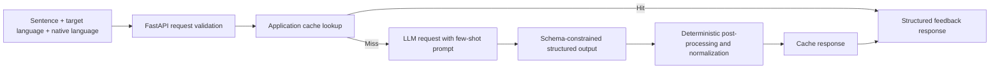

# Language Feedback API Task - Pangea Chat

This project is a multilingual language-feedback API for learners who want corrections that are accurate, minimal and easy to understand in their native language.

**User:** a language learner practicing a target language.  
**Input:** a sentence, the target language being learned and the learner's native language.  
**Output:** a corrected sentence when needed, structured error explanations in the learner's native language and a CEFR difficulty label.

The service is built as a FastAPI application with schema-constrained LLM output, deterministic post-processing, caching and defensive retry behavior.

## How it works



The model handles the linguistic task, while application code owns request validation, schema enforcement, logical consistency, retry policy and caching.

## API

### `POST /feedback`

Request:

```json
{
  "sentence": "Yo soy fue al mercado ayer.",
  "target_language": "Spanish",
  "native_language": "English"
}
```

Response shape:

```json
{
  "corrected_sentence": "Yo fui al mercado ayer.",
  "is_correct": false,
  "errors": [
    {
      "original": "soy fue",
      "correction": "fui",
      "error_type": "conjugation",
      "explanation": "You mixed two verb forms. You only need 'fui' here."
    }
  ],
  "difficulty": "A2"
}
```

### `GET /health`

Returns a simple health response for service checks.

## Design decisions

### Native-language explanations

Feedback is returned in the language the learner already understands. The prompt reinforces this behavior because a technically correct explanation is not useful if the learner cannot understand it.

### Minimal corrections

The service is designed to fix errors without unnecessarily rewriting a learner's sentence. If the original sentence is grammatically valid, post-processing preserves it exactly instead of "improving" style.

### CEFR as sentence complexity

The CEFR field reflects the complexity of the attempted sentence rather than the number of mistakes. This keeps difficulty labeling separate from correctness.

### Structured outputs

The model response is constrained by the response schema so downstream code receives a predictable contract. Enumerated error types, CEFR levels and `additionalProperties: false` reduce the amount of free-form parsing required after generation.

### Responses API with compatibility fallbacks

The primary path uses OpenAI's Responses API. The implementation also contains fallbacks for compatible structured-output paths so the service does not couple its entire contract to one request format.

## Failure handling

LLM output is treated as untrusted application input even when schema-constrained.

The service adds several defensive layers:

- **Post-processing** repairs contradictions between `is_correct`, `errors` and `corrected_sentence`.
- **Error-type normalization** maps near-miss labels to the supported taxonomy instead of letting small naming variations break the API contract.
- **Retry with exponential backoff** handles transient provider failures without retrying errors that are not expected to recover.
- **Bounded HTTP timeouts** keep provider calls from hanging indefinitely.
- **A reusable client** avoids unnecessary connection setup for every request.
- **Application caching** avoids repeating the same provider call for identical sentence/language inputs.

These checks keep provider behavior separate from the contract exposed to API consumers.

## Caching strategy

Two cache layers serve different purposes:

1. **Provider prompt caching** can reuse the large static prompt prefix.
2. **Application-level LRU caching** stores complete feedback responses keyed by sentence, target language and native language.

The application cache is bounded and language names are normalized before lookup so repeated equivalent requests can share a response.

## Validation strategy

The test suite checks the API at multiple layers rather than relying only on prompt quality.

- **API tests:** request validation, status codes, serialization and route behavior.
- **Feedback unit tests:** mocked model responses, correction logic and cache behavior.
- **Edge-case tests:** post-processing, normalization, retry behavior and error taxonomy.
- **Schema tests:** agreement between Pydantic models and JSON schemas.
- **Integration tests:** real provider calls across multiple languages and writing systems.

For languages not spoken by the developer, integration cases are grounded in task-provided examples and published grammar references, while structural checks verify the response contract independently of linguistic fluency.

## Design tradeoffs

- **LLM generation + deterministic post-processing:** the model provides multilingual flexibility, while deterministic code protects the API contract. This adds application logic but keeps the service from trusting generation blindly.
- **Few-shot prompting:** examples improve format and behavior consistency, but enlarge the static prompt. Prompt caching helps make that tradeoff practical.
- **In-memory LRU cache:** it is simple and fast for a single service process, but deliberately avoids introducing a distributed cache into a small API task.
- **Minimal correction policy:** preserving the learner's wording avoids over-editing, even when a more fluent rewrite might sound better.
- **Schema-constrained generation:** strict structure reduces parsing failures, while some semantic consistency still has to be enforced after generation.

## Run locally

```bash
git clone https://github.com/chinmayarvind23/pangea-intern-task-2026.git
cd pangea-intern-task-2026

cp .env.example .env
# Add the provider key used for local integration testing.

python -m venv .venv
source .venv/bin/activate
pip install -r requirements.txt

uvicorn app.main:app --reload
```

Health check:

```bash
curl http://localhost:8000/health
```

Run with Docker:

```bash
docker compose up --build
```

Run tests:

```bash
pytest tests/ -v
```

## Repository map

```text
app/
├── main.py       # FastAPI routes
├── feedback.py   # model call, prompt, normalization and retry logic
├── models.py     # typed request/response models
├── cache.py      # bounded application cache
└── config.py     # service configuration

schema/
├── request.schema.json
└── response.schema.json

tests/
├── test_api.py
├── test_feedback_unit.py
├── test_edge_cases.py
├── test_schema.py
└── test_feedback_integration.py
```

## Key files

- [FastAPI entrypoint](app/main.py)
- [Feedback pipeline](app/feedback.py)
- [Request and response models](app/models.py)
- [Application cache](app/cache.py)
- [Request schema](schema/request.schema.json)
- [Response schema](schema/response.schema.json)
- [API tests](tests/test_api.py)
- [Edge-case tests](tests/test_edge_cases.py)
- [Integration tests](tests/test_feedback_integration.py)
- [Task rules](RULES.md)
